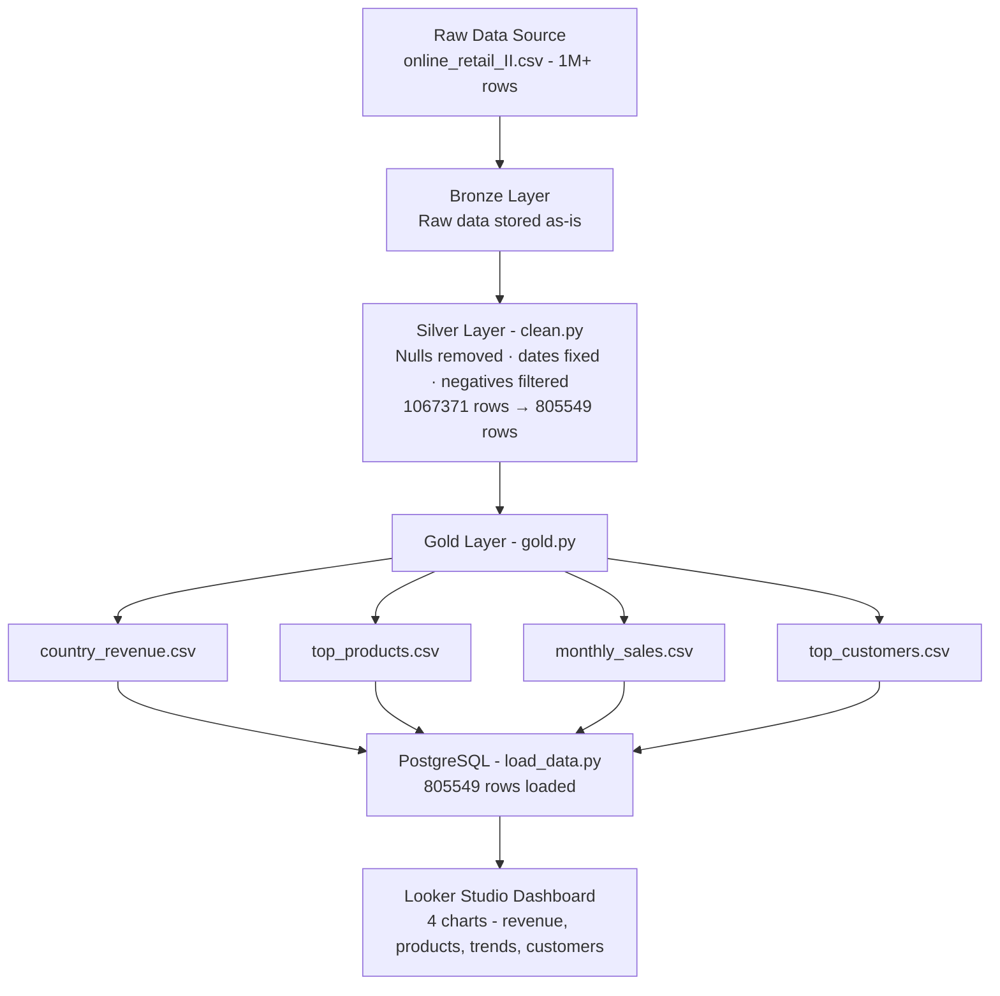
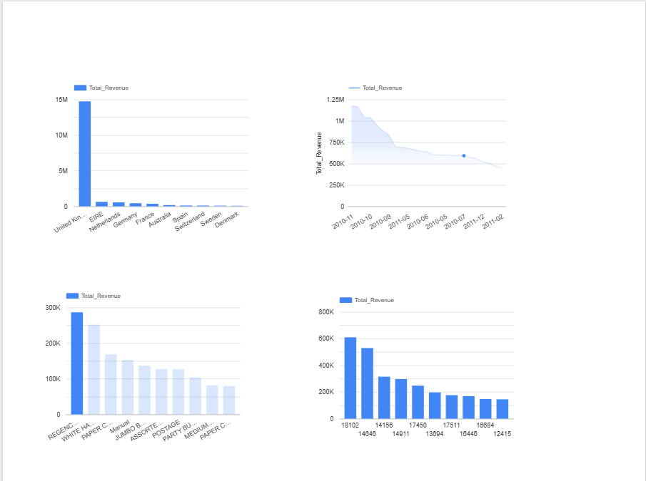

# Retail Analytics Pipeline

## Project Overview
An end-to-end data engineering pipeline that processes **1 million+ rows** of real retail data through Bronze, Silver, and Gold layers — delivering actionable insights via an interactive Looker Studio dashboard.

## Architecture Flow

## Tools Used
- **Python (Pandas)** — Data ingestion and transformation
- **PostgreSQL** — Data warehousing
- **Looker Studio** — Interactive dashboard
- **Git & GitHub** — Version control

## Pipeline Steps
1. **Bronze Layer** — Raw data stored as-is
2. **Silver Layer** — Cleaned data (removed nulls, fixed dates, filtered returns)
3. **Gold Layer** — Analytics-ready aggregations
4. **PostgreSQL** — 805,549 rows loaded into database
5. **Looker Studio** — 4 interactive charts created

## Dataset
- **Source:** Online Retail II (UCI) — Kaggle
- **Raw size:** 1,067,371 rows, 8 columns
- **After cleaning:** 805,549 rows

## Results
- 40+ countries analyzed
- Top revenue country: United Kingdom
- Dashboard covers: Country Revenue, Top Products, Monthly Trends, Top Customers

## Live Dashboard
[🔗 View Interactive Dashboard](https://datastudio.google.com/reporting/ae696a9b-17d7-4a25-88b4-3b7d573d9561)

