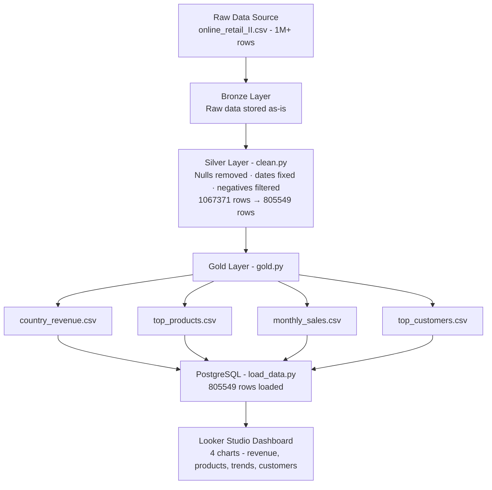

# End-to-End Azure Data Pipeline

## Project Overview
This project demonstrates a complete data engineering pipeline built using Python, PostgreSQL, and Looker Studio. It processes 1 million+ rows of real retail data through Bronze, Silver, and Gold layers.

## Architecture
## Architecture Flow

## Tools Used
- **Python (Pandas)** — Data ingestion and transformation
- **PostgreSQL** — Data warehousing (Synapse Analytics alternative)
- **Looker Studio** — Interactive dashboards (Power BI alternative)
- **Git & GitHub** — Version control

## Pipeline Steps
1. **Bronze Layer** — Raw data stored as-is
2. **Silver Layer** — Cleaned data (removed nulls, fixed dates, filtered returns)
3. **Gold Layer** — Analytics-ready aggregations
4. **PostgreSQL** — 805,549 rows loaded into database
5. **Looker Studio** — 4 interactive charts created

## Dataset
- Source: Online Retail II (UCI) — Kaggle
- Size: 1,067,371 rows, 8 columns
- After cleaning: 805,549 rows

## Results
- Total countries analyzed: 40+
- Top revenue country: United Kingdom
- Dashboard includes: Country Revenue, Top Products, Monthly Trends, Top Customers

## Live Dashboard
[🔗 View Interactive Dashboard](https://datastudio.google.com/reporting/ae696a9b-17d7-4a25-88b4-3b7d573d9561)

